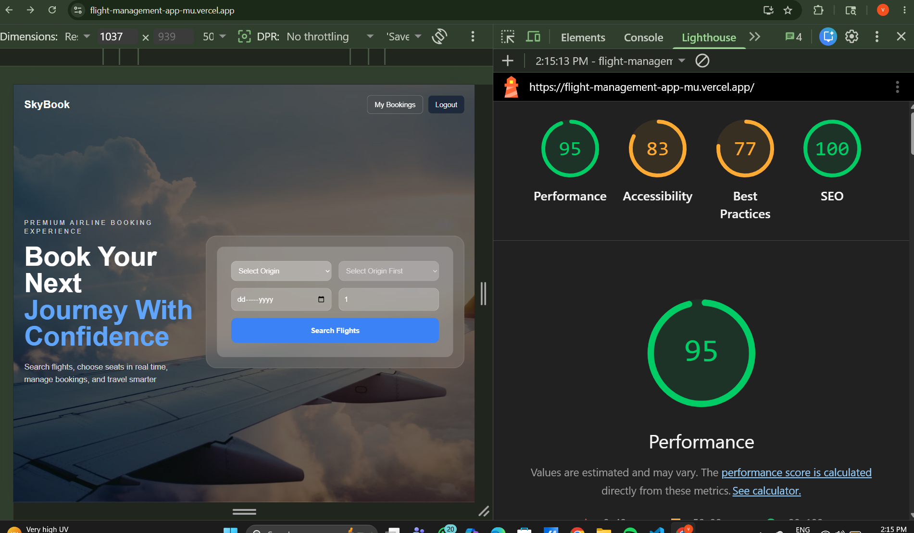
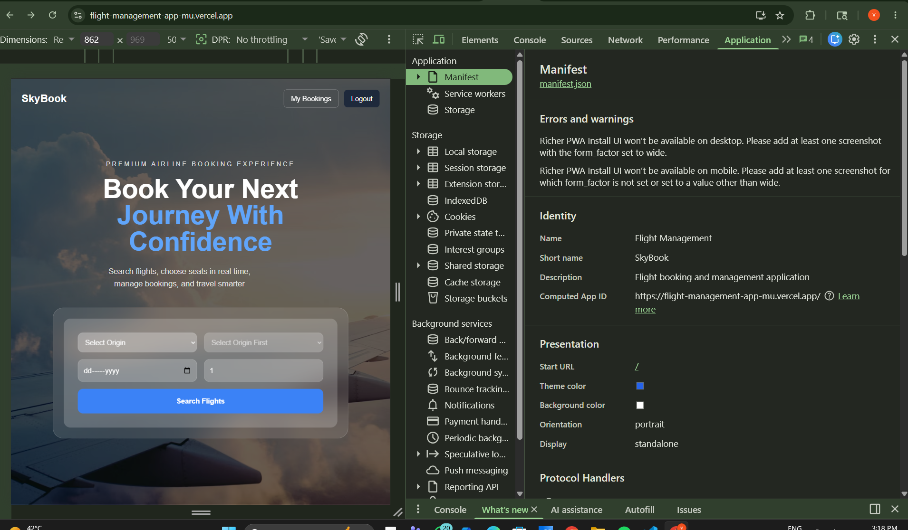

# Flight Management Application

A full-stack airline booking platform built with Next.js 14, Supabase, Zustand, Tailwind CSS, and PWA support.

## Live Demo

**Production URL:**  
https://flight-management-app-mu.vercel.app

---

## Demo Test Credentials

Use these credentials to test the application:

**Email:** vaibhav@gmail.com  
**Password:** 441100

---

## Features

### Authentication
- User signup/login using Supabase Auth
- Secure logout functionality
- Protected routes using middleware
- Server-side session validation

### Flight Search & Booking
- Search flights by:
  - Origin
  - Destination
  - Travel Date
  - Passenger Count
- View matching flights with:
  - Flight duration
  - Base pricing
  - Class options
- Passenger details collection
- Interactive seat selection
- Fare preview popup before booking confirmation
- Booking confirmation with generated PNR code

### Interactive Seat Selection
- Live aircraft seat map
- Separate cabin zones:
  - First Class
  - Business Class
  - Economy Class
- Color-coded seats:
  - Available
  - Occupied
  - Selected
  - Your seat
- Real-time seat availability updates using Supabase Realtime
- Mobile-friendly scrollable seat layout
- Tooltip showing seat upgrade fee

### Booking Management
- My Bookings dashboard
- Booking status badges:
  - Confirmed
  - Rescheduled
  - Cancelled
- Cancel booking with confirmation dialog
- Reschedule to same-route flights
- Automatic fee handling for higher-priced replacement flights
- 2-hour cancellation restriction enforced at database level

---

## Zustand State Management

### useFlightStore
Stores:
- Active search query
- Selected flight
- Selected seat
- Booking step
- Passenger form data

Features:
- Persistent booking recovery
- Optimistic seat selection
- Store reset actions
- `partialize` used to exclude sensitive passport information

### useUserStore
Stores:
- Supabase session token
- Cached bookings for offline access

---

## Progressive Web App (PWA)

Implemented using `next-pwa`

Features:
- Installable app experience
- Offline fallback page
- Manifest configuration
- Static asset caching
- Flight search caching
- Cached bookings available offline

---

## Tech Stack

### Frontend
- Next.js 14 (App Router)
- TypeScript
- Tailwind CSS

### Backend / Database
- Supabase
- PostgreSQL
- Supabase Auth
- Supabase Realtime

### State Management
- Zustand

### Deployment
- Vercel

---

## Database Schema

Tables used:

- flights
- seats
- bookings
- passengers
- reschedules

### Database Features
- Row Level Security (RLS)
- Seat reservation RPC to prevent double booking
- Atomic cancellation RPC
- Database trigger preventing cancellation within 2 hours of departure

---

## Supabase Migrations

Location:

```bash
/supabase/migrations
```

Included migration files:

- 001_create_flights.sql
- 002_create_seats.sql
- 003_create_bookings.sql
- 004_create_passengers.sql
- 005_create_reschedules.sql
- 006_rls_policies.sql
- 007_seat_lock_rpc.sql
- 008_cancel_booking_rpc.sql
- 009_departure_trigger.sql
- 010_seed_flights.sql
- 011_seed_seats.sql
- 012_reschedule_booking_rpc.sql

---

## Local Setup

### Clone Repository

```bash
git clone YOUR_GITHUB_REPOSITORY_URL
cd Flight-Management-App
```

### Install Dependencies

```bash
npm install
```

### Environment Variables

Create a `.env.local` file:

```env
NEXT_PUBLIC_SUPABASE_URL=your_supabase_project_url
NEXT_PUBLIC_SUPABASE_ANON_KEY=your_supabase_anon_key
SUPABASE_SERVICE_ROLE_KEY=your_supabase_service_role_key
```

### Start Local Supabase

```bash
supabase start
supabase db reset
```

### Start Development Server

```bash
npm run dev
```

Open:

```bash
http://localhost:3000
```

---

## Deployment

Deployed on Vercel:

https://flight-management-app-mu.vercel.app

---

## Lighthouse PWA Audit

Add Lighthouse screenshot here after running audit.

Example:

```md

```

---

## Submission Checklist

- Public GitHub repository
- Supabase migration SQL files included
- Seed data included
- Demo test credentials provided
- Zustand architecture documented
- Production deployment included
- PWA support implemented

---

## Lighthouse Audit

Performance audit on production deployment:



---

## PWA Implementation Proof

Progressive Web App manifest and installability configuration:



## Author

Developed by Vaibhav Singh